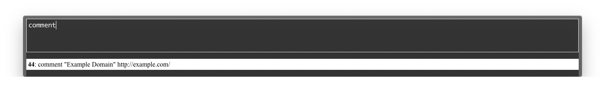

# post-tweet

Post only twitter client application.



post-tweet should be launched by [URL Schema](https://github.com/azu/post-tweet#url-schema).

## Installation

    yarn
    yarn dist
    # output binary

## Usage

1. Open app
2. Input description
3. Post tweet by <kbd>Cmd+Shift+Enter</kbd> shortcut

## URL Schema

post-tweet support `post-tweet://` schema.

You can open the app from your browser.
 `post-tweet://` schema support following parameter.

- `url`: URL
- `title`: Title
- `quote`: Quoted text

Example:

```js
const selectedText = window.getSelection().toString();
location.href = `post-tweet://?url=${encodeURIComponent(window.top.location.href)}&title=${encodeURIComponent(window.top.document.title)}&quote=${encodeURIComponent(selectedText)}`
```
## Contributing

1. Fork it!
2. Create your feature branch: `git checkout -b my-new-feature`
3. Commit your changes: `git commit -am 'Add some feature'`
4. Push to the branch: `git push origin my-new-feature`
5. Submit a pull request :D

## License

MIT
